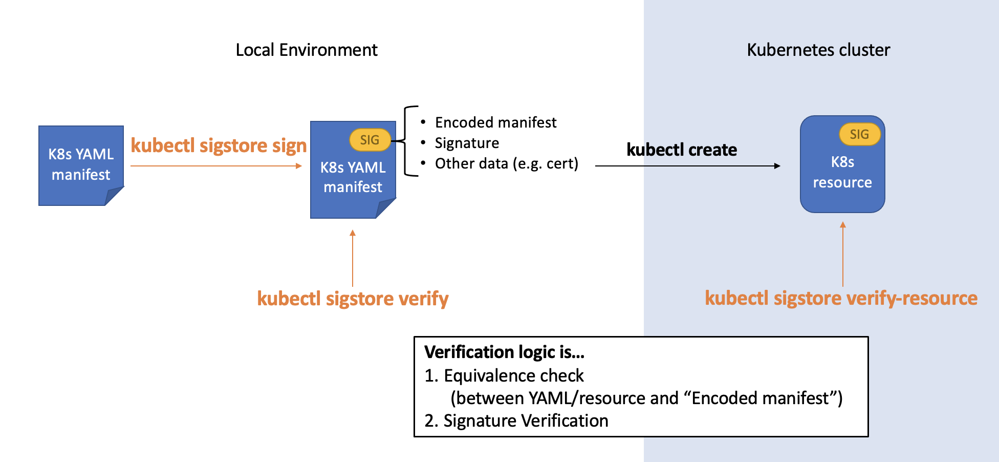
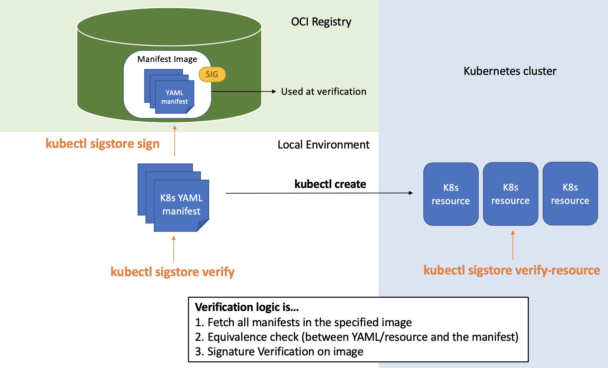

# What's new in v0.1.0

This is the first release of the project!

In this release, a kubectl subcommand plugin is ready, which can be used for signing and verifying Kubernetes YAML manifests and resources.

The overview of this kubectl subcommand plugin is like the below. An application developer can sign their YAML manifest, and its user (=deployer) can verify it in local environment, and also they can verify the Kubernetes resource which is deployed with a signed YAML manifest.


## Easy install & simple use
You can install it by a single command.
```
$ go install github.com/sigstore/k8s-manifest-sigstore/cmd/kubectl-sigstore@latest
```

Once installed, you can use it as a kubectl subcommand like `kubectl sigstore sign`.

## Sign and verify Kubernetes YAML manifests & resources

To sign your YAML manifest, there are 2 options about how to store a signature.

1. self-contained manifest
  - signature is embedded into YAML annotation

2. OCI registry
  - manifest is uploaded to OCI registry as image, and a signature is attached to the image

### self-contained manifest

The image below describes how signing works against YAML manifest and how the generated self-contained manifest and its resource  can be verified.



The command to sign a YAML manifest is like this.

```
$ kubectl sigstore sign -f sample-manifest.yaml -k cosign.key
```

This command generates a self-contained manifest at `sample-manifest.yaml.signed`.

To verify it, you can do this command.
```
$ kubectl sigstore verify -f sample-manifest.yaml.signed -k cosign.pub
```

After deploying resource with the manifest, you can verify it like this.

```
$ kubectl sigstore verify-resource cm -n sample-ns sample-configmap -k cosign.pub
```

For verify-resource command, you can use the same arguments as `kubectl` get command.

### Using OCI registry

The image below describes how signing against a sort of YAMl manifests works and how the manifests and signature are stored in OCI registry.



The command to sign multiple YAML manifests is like this. This exmaple is singing `./yamls/` directory in which manifests are contained.

```
$ kubectl sigstore sign -f ./yamls/ -k cosign.key -i sample-registry/sample-manifest:dev
```

The difference from self-contained case is `-i` option, users can specify a name of image which contains manifests and which is signed by this command.

You can verify the manifests and resources with `-i` or `--image` option.

```
# for local manifests
$ kubectl sigstore verify -f ./yamls/ -k cosign.pub -i sample-registry/sample-manifest:dev

# for resources on a cluster
$ kubectl sigstore verify-resource -n sample-ns -i sample-registry/sample-manifest:dev
```

About verify-resource command above, it automatically find the target resources to be verified in `sample-ns`, so you don need to specify K8s kind or resource names.

## Example of admission controller implementation

A reference impletementation of admission controller with verify-resource feature is inside [example/admission-controller](example/admission-controller) directory.

For more comprehensive admission controller implementation which uses this project, you can try [Integrity Shield](https://github.com/open-cluster-management/integrity-shield).


