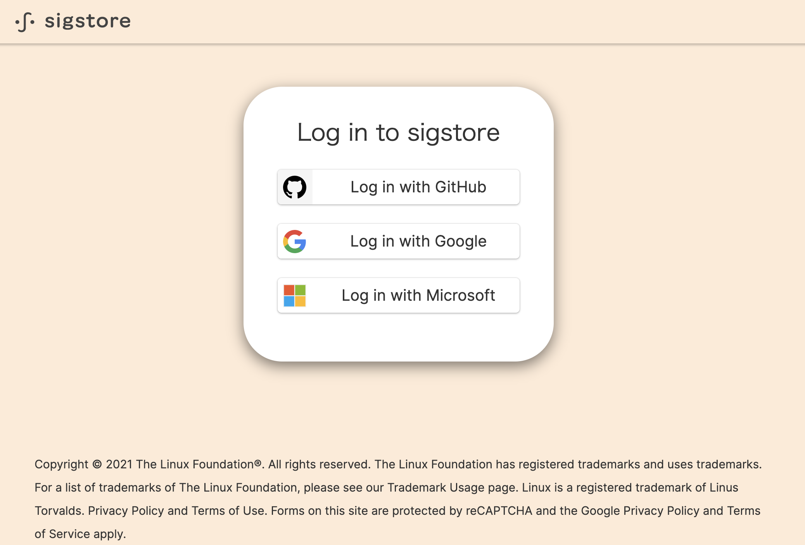

# What's new in v0.1.0

This is the first release of the project!

This project provides a kubectl subcommand plugin, which is for signing specification of Kubernetes YAML manifests and for verifying YAML manifest files on local file system / Kubernetes resources on a cluster.

## Easy Install & Setup
You can install it by a single command.
```
$ go install github.com/sigstore/k8s-manifest-sigstore/cmd/kubectl-sigstore@latest
```

Here, please setup your cosign key pair by `cosign generate-key-pair` if you want to sign YAML manifests with it.

Otherwise, you can sign manifests by keyless signing. To enable it, please do this beforehand.

```
$ export COSIGN_EXPERIMENTAL=1
```

In this document, keyless signing case is described.

## Sign Kubernetes YAML manifest specification

Now it's ready for signing!

The manifest information is canonicalized before signing, and it checks matching of all specification in YAML manifests at the time of verification. In other words, this signing feature is not just a blob signing.

```
$ kubectl sigstore sign -f sample-configmap.yaml
```

Then your web browser should open the web page like this. You can choose your OIDC account to do keyless signing with.
<!--

-->


A signature is embedded into the YAML manifest, and it generates a new YAML manifest which is named like `<original-name>.yaml.signed` by default.

To check the embedded signature, you can do it by this command.

```
$ cat sample-deployment.yaml.signed | grep signature
    cosign.sigstore.dev/signature: MEQCI ... vww==
```


You can sign a directory which contains multiple YAML files.

```
$ tree yamls/
yamls
|-- sample-configmap.yaml
`-- sample-deployment.yaml

$ kubectl sigstore sign -f yamls/ -i sample-registry/sample-manifest:dev
```

Also, in this example, a signature is not embedded to a manifest file, but uploaded to OCI registry.

This uploaded image is called "manifest bundle image".

## Verify Local YAML manifest files

To verify specification of local YAML manifest file, you can execute this command.

```
$ kubectl sigstore verify -f sample-deployment.yaml.signed
INFO[0000] verifed: true, signerName: sample-signer@example.com
```

If specification in the YAML file has been changed after signing, the verification fails.

```
$ kubectl sigstore verify -f sample-deployment.yaml.signed
FATA[0000] verifed: false, error: Diff found in Deployment sample-deployment, diffs:{"items":[{"key":"spec.template.spec.containers.0.image","values":{"after":"ubuntu:18.04","before":"ubuntu:20.04"}}]}
```

## Verify Kubernetes resources on a cluster

Also, you can verify a Kuberentes resource which is deployed from signed YAML manifest.

To specify resources, you can use the same arguments as `kubectl get` command. 

```
$ kubectl create -n default -f sample-deployment.yaml.signed
deployment.apps/sample-deployment created

$ kubectl sigstore verify-resource deploy -n default sample-deployment
INFO[0000] identifying target resources.
INFO[0000] loading some required data.
INFO[0000] verifying the resources.
[SUMMARY]
TOTAL   VALID   INVALID
1       1       0

[RESOURCES]
KIND         NAME                VALID   ERROR   AGE
Deployment   sample-deployment   true            105s

INFO[0010] Total elapsed time: 4.202231s (initialize: 0.046577s, verify: 4.154735s, print: 0.000919s)
```

If you have signed the manifest with `-i` / `--image` option, you don't need to specify resources manually. 

By specifying a manifest bundle image, the target resources are automatically selected.

```
$ kubectl sigstore verify-resource deploy -n default -i sample-registry/sample-manifest:dev
```

## Configuration

You can customize a configuration for verification.

A sample configuration file is at `example/config.yaml`, so please refer to it.

For example, if you want to ignore some fields on verification, you can write a config file like this.
```
ignoreFields:
  - objects:
    - kind: Deployment
      name: sample-deployment
    fields:
    - spec.replicas
```

The field `spec.replicas` is ignored on verification with `-c` / `--config` option like below.

```
$ kubectl scale deploy -n default sample-deployment --replicas=2
deployment.apps/sample-deployment scaled

$ kubectl sigstore verify-resource deployment -n default sample-deployment -c config.yaml
INFO[0000] identifying target resources.
INFO[0000] loading some required data.
INFO[0000] verifying the resources.
[SUMMARY]
TOTAL   VALID   INVALID
1       1       0

[RESOURCES]
KIND         NAME                VALID   ERROR   AGE
Deployment   sample-deployment   true            4m

INFO[0010] Total elapsed time: 4.183395s (initialize: 0.035943s, verify: 4.147402s, print: 5e-05s)
```

Also, if you want to specify signers, the config file will be like this.

```
signers:
- sample-signer@example.com
```

If the signer of signature does not match this configuration, the verification fails.


## Example of admission controller implementation

The verification feature can be invoked at the time of a resource admission.

This project has a simple implementation of admission controller, which is in `example/admission-controller` directory.

Additionally, one example of more full-featured admission controller is [integrity-shield project](https://github.com/IBM/integrity-shield).


