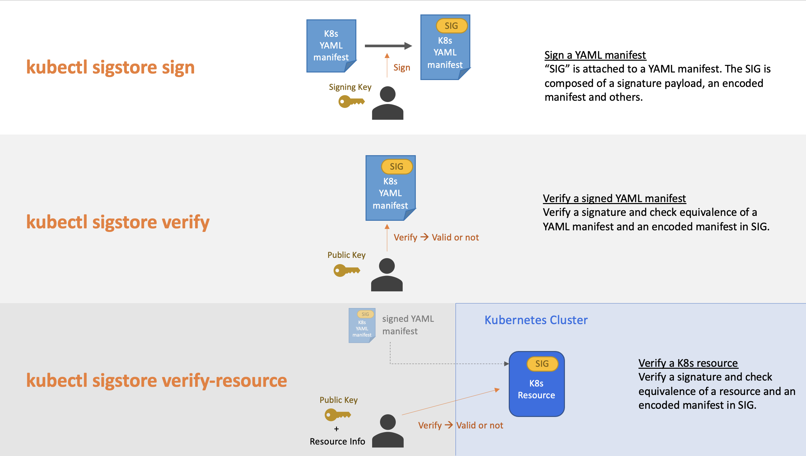
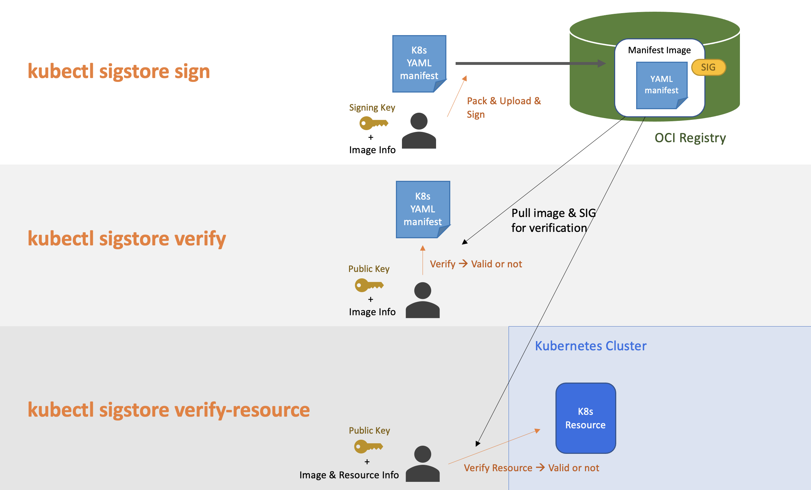
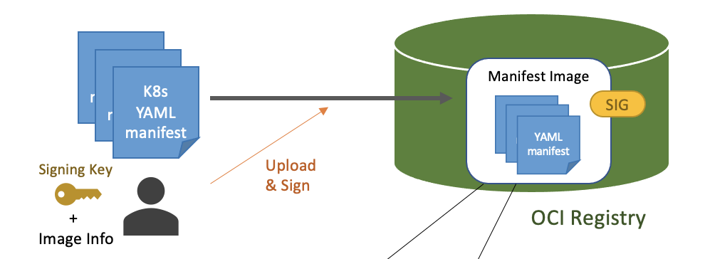

# What's new in v0.4.3

This release is a minor update to update the cosign version to v1.13.1.

---

# Backlog 

---
# What's new in v0.4.2

This release is a minor update to update the cosign version to v1.13.0.


---

# What's new in v0.4.1

In this release, we updated cosign version to v1.12.1 and added some CLI options as well as cosign.

## Add `--allow-insecure-registry` for sign/verify commands

Using cosign v1.12.0 and later, an insecure container registry must be accessed intentionally with `--allow-insecure-registry` option.

We have added the same CLi option to sign/verify command in this project too.

(Note: If you use images on ghcr.io, basically need to specify this option.)

## Add `--force` for sign command

Now cosign has `--force` option for sign command, and we have added it to this project too.

If you want to skip some validations/checks using interactive CLI input while cosign signing, this option works for it.

It is also used when the signing steps are automated and when you cannot input anything while the signing.


---

# What's new in v0.4.0

In this release, a new signing method is added to `kubectl sigstore sign` command. It is not a default signing option yet, but we are planning the method will be default on the release v0.5.0 and later. The detail is described below.

## Add a new signing method and the original signing method will be non-default soon

The original signing method (`--tarball=yes`) creates a tarball of YAML files before signing.

However, this may cause verification error when multiple signatures are provided.

So we have added a new signing method (`--tarball=no`) that can solve this issue.

The original method is still the default option now, but the new one will be default on v0.5.0 and later.

## Support multiple signatures both for signing & verification

A new signing option `--append-signature` (or `-A`) has been added for users to generate a signed YAML manifest that have multiple signatures.

Users don't need to manually add them anymore.

## Update cosign version to v1.10.1

We updated the version of cosign on which k8s-manifest-sigstore depends, and added some new command options to be consistent with cosign

---

# What's new in v0.3.0

In this release, we mainly updated verification functions so that users can easily & flexibly use `k8s-manifest-sigstore`.

In particular, now all verification functions do not require any file-write permission on local file system, so users can use `k8s-manifest-sigstore` verification in a read-only environment such as a read-only container.

## Verification features are all "read-only" in this version!

`k8s-manifest-sigstore` does not create/update/delete any files including temporary files while verification.
You can use it inside your project that need to be run in a read-only container / in a least privilege environment.

## Support multiple ways to input public key**

Now we support the following 2 types of public key reference. You can use them when the public key is not a local file.

- If the public key is in a Kubernetes secret deployed on a cluster, you can specify it with `k8s://` prefix.

    ```
    # example of a secret from the public key file
    $ kubectl create secret -n sample-namespace generic pubkey-secret --from-file=publickey=<PATH/TO/PUBLIC_KEY>

    # you can specify the secret in "k8s://namespace/name" format
    $ kubectl sigstore verify-resource <KIND> [-n <NAMESPACE>] [<NAME>] --key k8s://sample-namespace/pubkey-secret
    ```

- If PEM data of the public key is set as an environment variable, you can specify it with `env://` prefix.

    ```
    # example of the public key PEM in an environment variable
    $ export MANIFEST_VERIFICATION_KEY=$(cat <PATH/TO/PUBLIC_KEY>)

    # you can specify the secret in "env://variablename" format
    $ kubectl sigstore verify-resource <KIND> [-n <NAMESPACE>] [<NAME>] --key env://MANIFEST_VERIFICATION_KEY
    ```

## Prepare an example code to use `verify-resource` with a custom configuration in your project 

We prepared a new example code which imports `k8s-manifest-sigstore` as an external module and calls the `VerifyResource()` function with a custom `ignoreFields` configuration defined in the code.

This would be useful for developers to know how to implement a go project which leverages the `VerifyResource()` feature inside their codes.

The sample code is easy to run, so you can try it just by the command as below.

```
$ cd example/verify-resource
$ go run sample.go
```

## Support multiple signatures for verification

We newly support multiple signatures for verification. In addition to the default signature, you can specify the other ones by using `AnnotationConfig` configuration both from CLI and from codes.

An example of AnnotationConfig for this is like the following. In this case, 2 annotations `cosign.sigstore.dev/signature` (default one) and `cosign2.sigstore.dev/signature-alt` (added by this config) will be used. 

```
vo := &VerifyResourceOption{}
vo.AnnotationConfig = AnnotationConfig{
    AdditionalSignatureKeysForVerify: []string{
        "cosign2.sigstore.dev/signature-alt",
    },
}
```

When multiple signatures are specified, verification will be ok if at least 1 signature is successfully verified.

## Add some options for a custom "verify-resource"

The following 2 options are added as verify-resource options to enable flexible verification configuration.

- `DisableDryRun`
    - Some users may want to diable dry run feature because it requires some more RBAC permissions compared to no dry-run case, so they can use this option for that purpose.
- `CheckMutatingResource`
    - If multiple mutating webhooks mutate one resource and if verify-resource is used in one of the mutating webhooks, the specified resource might be not an actual resource but an intermediate object which is on the way of mutation. With this option, k8s-manifest-sigstore supports the verification for this kind of intermediate objects, so users can safely use verify-resource in such an admission controller.

## Update cosign version to v1.8.0

The dependency version of cosign is updated to v1.8.0.


---

# What's new in v0.1.0

This is the first release of the project!

In this release, a kubectl subcommand plugin is ready, which can be used for signing and verifying Kubernetes (K8s) YAML manifests and resources.

This plugin has 3 major operations around singing and verification as below.



- `kubectl sigstore sign` generates signature data ("SIG" in the figure) and attach it to a YAML manifest.
- `kubectl sigstore verify` verifies the signature in the signed YAML manifest, and checks equivalence of an input YAML manifest and encoded manifest data in "SIG".
- `kubectl sigstore verify-resource` verifies the signature in the speciifed resource, and it checks equivalence between the resource and an encoded manifest in "SIG".

## Easy install & simple use
You can install it by a single command.
```
$ go install github.com/sigstore/k8s-manifest-sigstore/cmd/kubectl-sigstore@latest
```

Once installed, you can use it as a kubectl subcommand like `kubectl sigstore sign`.

## Sign and verify Kubernetes YAML manifest & resource

The command to sign a YAML manifest is like this. (About `cosign.key`, please refer to [this](https://github.com/sigstore/cosign/blob/main/doc/cosign_generate-key-pair.md).)

```
$ kubectl sigstore sign -f sample-manifest.yaml -k cosign.key
```

This command generates a self-contained manifest with signature and several other data.

To verify the signed YAML manifest, you can do it by this command.
```
$ kubectl sigstore verify -f sample-manifest.yaml.signed -k cosign.pub
```

After deploying a resource with the signed YAML manifest, you can verify it by specifying the resource with the same arguments as `kubectl get` command.

```
$ kubectl sigstore verify-resource cm -n sample-ns sample-configmap -k cosign.pub
```


## Using OCI registry

Additionally, another way to store signature is supported in this release. It uses OCI registry.

The overall flow is described as the image below. `kubectl sigstore sign` command creates "manifest image" which contains a YAML manifest inside, and push it to OCI registry, and then sign the manifest image. This mode does not require any change in the original YAML manifest.

For verification, `kubectl sigstore verify` and `verify-resource` commands pull the specified manifest image, and check the signature of it.



To sign a YAML manifest using OCI registry, you can use this command. This command uploads a manifest as an image `sample-registry/sample-manifest:dev`, and signs the image.

```
$ kubectl sigstore sign -f sample-manifest.yaml -k cosign.key -i sample-registry/sample-manifest:dev
```

This way of signing does not requires changes in a YAML manifest, so you can verify the original YAML manifest like this.

```
$ kubectl sigstore verify -f sample-manifest.yaml -k cosign.pub -i sample-registry/sample-manifest:dev
```

A resource created from this YAML manifest also can be verified.

In this case, a target resource of verification is automatically selected by checking a manifest in image, so you don't need to specify resource information other than namespace.


```
$ kubectl sigstore verify-resource -n sample-ns -k cosign.pub -i sample-registry/sample-manifest:dev
```

Also, this mode (using OCI registry) is useful to sign multiple YAML manifests at once. In the case, the corresponding resources to manifests can be verified by a single verification. Ths signing part against multiple YAMLs is explained as below.



For working with multiple YAML manifests, the commands are like the following.

```
# sign multiple YAML manifests at once ("yamls" is a directory for them)
$ kubectl sigstore sign -f ./yamls/ -k cosign.key -i sample-registry/sample-manifest:dev

# verify a local manifest
$ kubectl sigstore verify -f ./yamls/sample-manifest.yaml -k cosign.pub -i sample-registry/sample-manifest:dev

# verify resources on a cluster at once
$ kubectl sigstore verify-resource -n sample-ns -i sample-registry/sample-manifest:dev
```


## Example of admission controller implementation

A reference impletementation of admission controller with verify-resource feature is inside [example/admission-controller](../example/admission-controller) directory.

For more comprehensive admission controller implementation which uses this project, you can try [Integrity Shield](https://github.com/open-cluster-management/integrity-shield).


